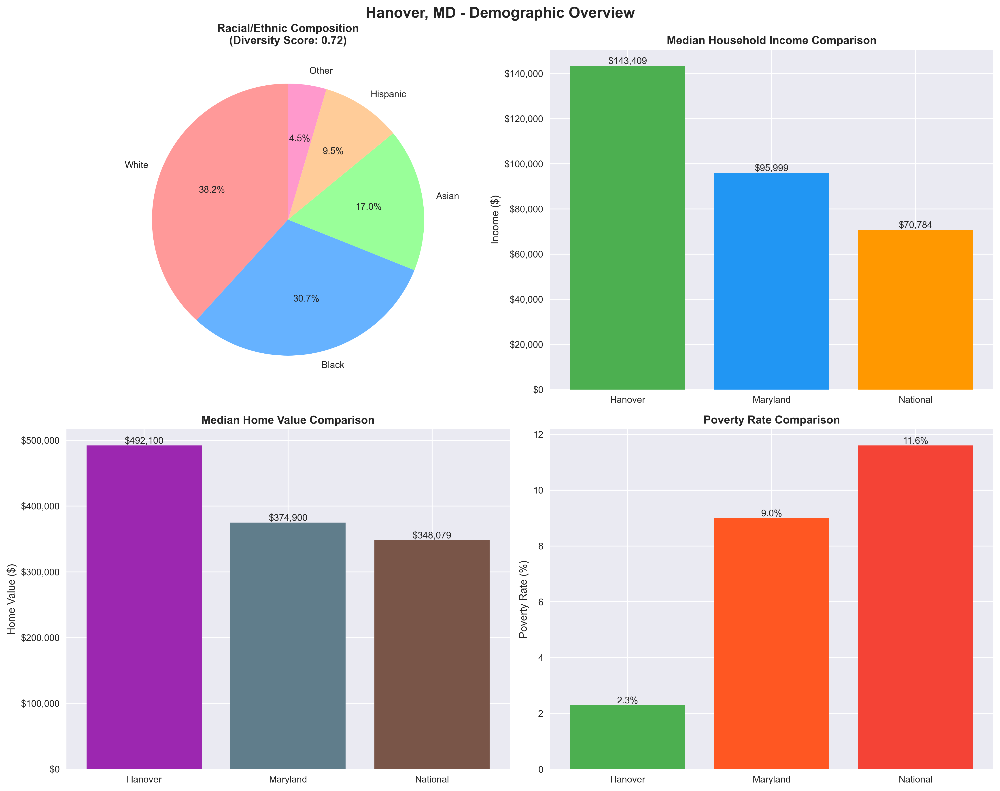
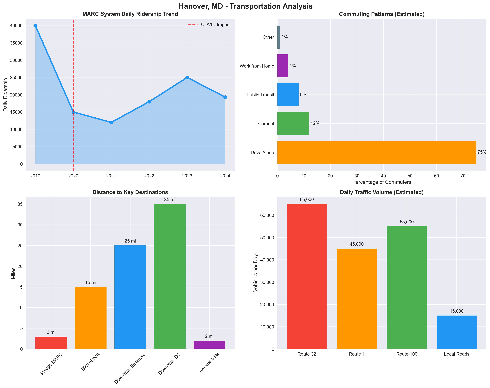
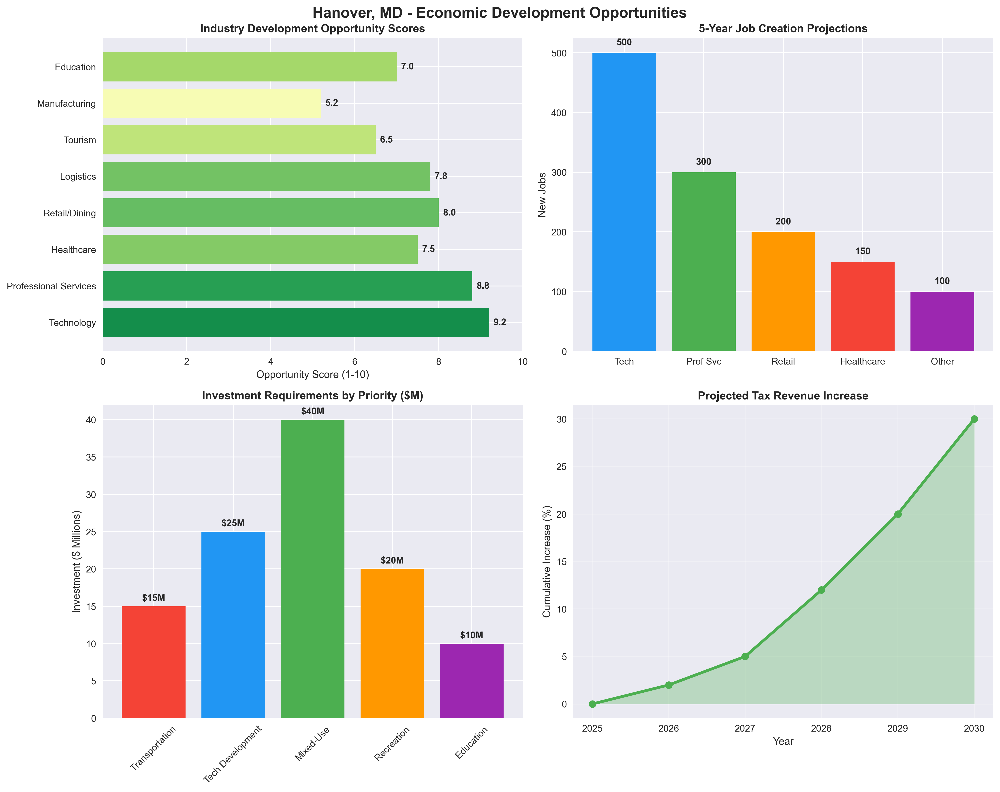
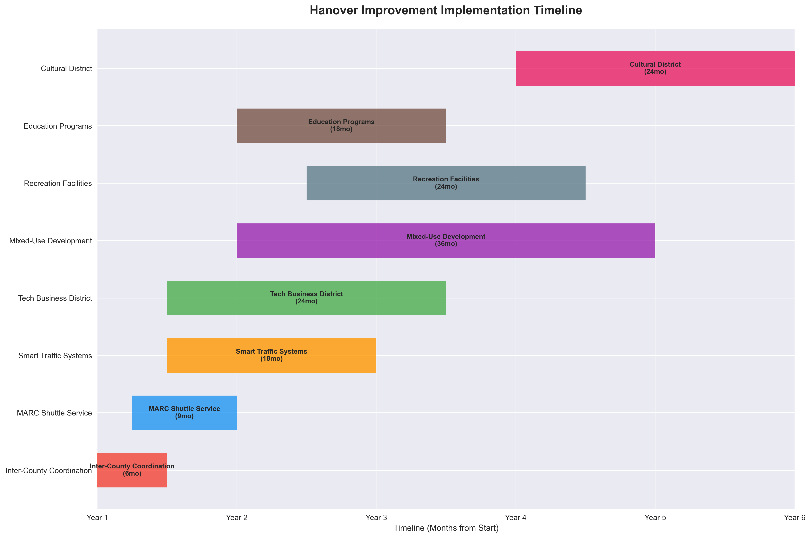
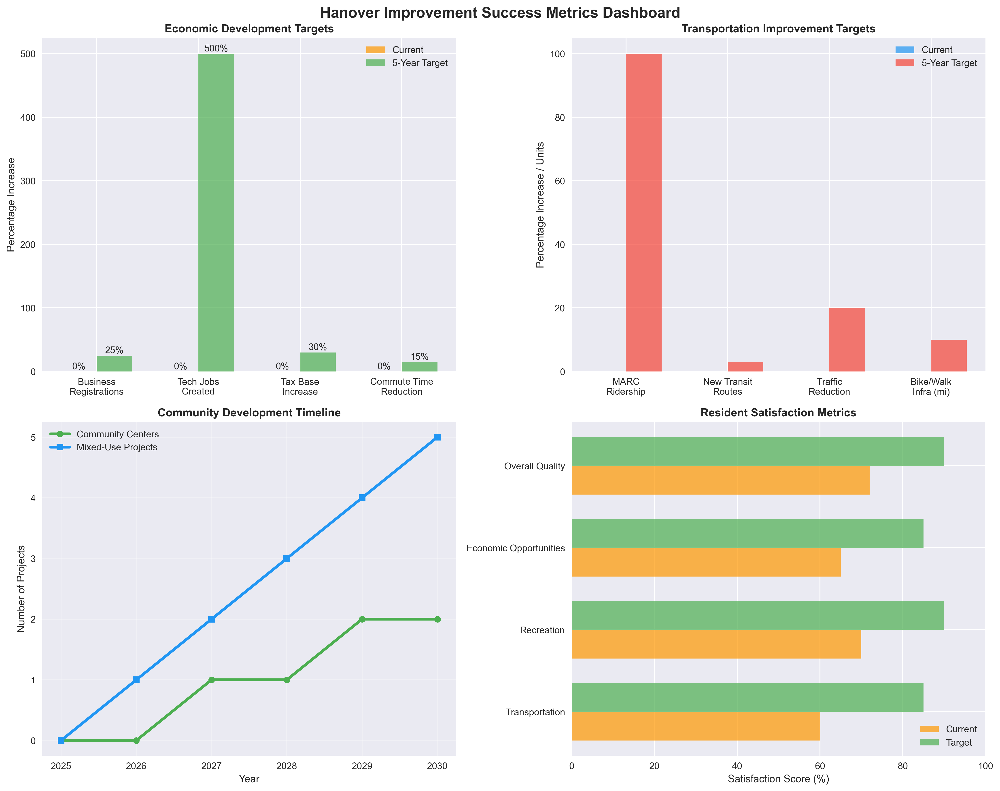

# Hanover, Maryland Community Improvement Analysis Report

**Analysis Date:** September 21, 2025
**Geographic Focus:** ZIP Code 21076
**Population:** 28,089 residents
**Counties:** Howard County and Anne Arundel County

---

## Executive Summary

Hanover, Maryland represents a unique opportunity for strategic community improvement. With a population of 28,089 residents, a high median household income of $143,409, and a diversity score of 0.72, Hanover possesses the economic foundation and demographic strengths necessary for significant enhancement initiatives.

### Key Community Characteristics
- **High-income, educated population** ($143,409 median household income)
- **Highly diverse community** (38.2% White, 30.7% Black, 17.0% Asian, 9.5% Hispanic)
- **Strategic geographic location** (proximity to BWI Airport, Baltimore-Washington corridor)
- **Strong real estate market** ($492,100 median home value)
- **Low poverty rate** (2.3%)
- **Split jurisdiction** (spans Howard and Anne Arundel Counties)

---

## Demographic Analysis

*Figure 1: Comprehensive demographic analysis showing Hanover's diversity, income levels, housing values, and poverty rates compared to Maryland and national averages*

### Strengths
- **Economic Foundation:** High-income community provides strong tax base and consumer spending power
- **Diversity Advantage:** High diversity score (0.72) creates cultural richness and varied skill sets
- **Working-Age Population:** Median age of 35.9 indicates productive workforce
- **Low Poverty:** 2.3% poverty rate demonstrates economic stability
- **Real Estate Strength:** $492,100 median home value indicates desirable community

### Challenges
- **Housing Affordability:** High home values may limit new resident attraction
- **Dual County Jurisdiction:** Coordination complexity between Howard and Anne Arundel Counties

---

## Infrastructure and Transportation Analysis

*Figure 2: Transportation infrastructure analysis including MARC ridership trends, commuting patterns, distances to key destinations, and traffic volumes*

### Current Situation
- **MARC Access:** 3 miles to Savage MARC station (Camden Line)
- **Reduced Transit Ridership:** MARC ridership down from 40,000 to 19,300 (post-COVID)
- **Major Roads:** Route 32, Route 1, Route 100, I-95 access
- **School Districts:** Access to both Howard County and Anne Arundel County Public Schools

### Transportation Gaps
1. **Limited MARC connectivity** - 3-mile distance to nearest station
2. **Reduced public transit service** - Post-COVID ridership decline
3. **Inter-county coordination challenges** - Split jurisdiction complicates planning
4. **Internal connectivity** - Limited public transit within community

### Transportation Opportunities
1. **MARC service enhancement** - Restore and improve Camden Line service
2. **Shuttle services** - Connect Hanover to Savage MARC station
3. **Smart traffic management** - Optimize Route 32 and major corridor flow
4. **Pedestrian/cycling infrastructure** - Enhance walkability and connectivity

---

## Education Landscape

### Strengths
- **Dual School District Access:** Benefits from both Howard County Public Schools (4th largest in MD) and Anne Arundel County Public Schools (85,000+ students)
- **High-Performing Districts:** Both districts maintain strong academic reputations
- **Specific Schools Identified:**
  - Harmans Elementary School (Anne Arundel County)
  - Arundel Middle School (Anne Arundel County)
  - Multiple Howard County options

### Educational Opportunities
1. **Adult Education Programs** - Serve growing population needs
2. **STEM Education Partnerships** - Leverage proximity to BWI/DC tech corridor
3. **Community College Satellites** - Expand higher education access
4. **Workforce Development** - Align training with regional economic opportunities

---

## Economic Development Analysis

*Figure 3: Economic development analysis showing industry opportunity scores, job creation projections, investment requirements, and projected economic impact over time*

### Strategic Advantages
1. **Geographic Position:** Proximity to BWI Airport and Baltimore-Washington corridor
2. **High-Income Residents:** $143,409 median household income supports local business
3. **Diverse Talent Pool:** 72% diversity score provides varied skill sets
4. **Transportation Access:** Major highway connectivity (Route 32, I-95)
5. **Educational Resources:** Access to high-performing school districts

### Development Opportunities
1. **Technology Sector Development**
   - Leverage proximity to BWI and DC tech corridor
   - Target 500+ new tech jobs
   - Develop business parks and incubators

2. **Mixed-Use Development**
   - Create walkable commercial districts
   - Integrate retail, dining, and professional services
   - Target areas near Arundel Mills for expansion

3. **Professional Services Hub**
   - Serve affluent resident base
   - Legal, financial, consulting services
   - Remote work support infrastructure

4. **Tourism and Historical Development**
   - Leverage Savage Mill historic site
   - Cultural tourism opportunities
   - Arts and entertainment venues

---

## Priority Recommendations

### High Priority (Year 1)

#### 1. Transportation Enhancement
**Action:** Improve MARC connectivity and internal transportation
- Establish shuttle service to Savage MARC station
- Advocate for increased Camden Line service frequency
- Implement smart traffic management on Route 32
- **Stakeholders:** Howard County, Anne Arundel County, MTA
- **Timeline:** 12 months
- **Investment:** $2-5 million

#### 2. Technology Sector Attraction
**Action:** Develop technology business district
- Create tech-friendly zoning policies
- Establish business incubators and co-working spaces
- Target BWI corridor technology companies
- **Stakeholders:** Economic development agencies, private developers
- **Timeline:** 18 months
- **Investment:** $10-20 million

#### 3. Inter-County Coordination Framework
**Action:** Establish formal coordination mechanism
- Create joint planning committee
- Develop shared service agreements
- Coordinate infrastructure investments
- **Stakeholders:** Both county governments, state legislature
- **Timeline:** 6 months
- **Investment:** $500K annually

### Medium Priority (Years 2-3)

#### 4. Mixed-Use Commercial Development
**Action:** Create walkable commercial districts
- Zone for mixed-use development
- Attract premium retail and dining
- Develop community gathering spaces
- **Investment:** $25-50 million (private sector led)

#### 5. Educational Enhancement
**Action:** Expand adult and workforce education
- Establish community college satellite
- Create workforce development partnerships
- Develop STEM education programs
- **Investment:** $5-10 million

#### 6. Premium Recreation Facilities
**Action:** Develop high-quality community amenities
- Build sports complexes and fitness facilities
- Create cultural venues and programming
- Enhance green spaces and trails
- **Investment:** $15-30 million

### Long-Term Goals (Years 4-5)

#### 7. Cultural District Development
**Action:** Establish arts and cultural amenities
- Leverage community diversity
- Create performance venues and galleries
- Develop cultural programming
- **Investment:** $20-40 million

#### 8. Regional Transportation Hub
**Action:** Position Hanover as transportation nexus
- Enhanced MARC service
- Improved highway access
- Multi-modal transportation center
- **Investment:** $50-100 million

---

## Implementation Roadmap

*Figure 4: Implementation timeline showing the coordination and sequencing of major improvement projects over a 5-year period*

### Year 1 Milestones
- **Q1:** Establish inter-county coordination committee, begin transportation study
- **Q2:** Complete economic development assessment, initiate zoning reviews
- **Q3:** Begin traffic management planning, identify tech development sites
- **Q4:** Launch pilot MARC shuttle, finalize development incentives

### Years 2-3 Targets
- Implement smart traffic systems
- Begin major development projects
- Establish education programs
- Complete recreational facilities
- Launch tech sector recruitment

### Years 4-5 Objectives
- Complete infrastructure improvements
- Establish regional tech hub status
- Full inter-county coordination
- Cultural district completion
- Achieve all success metrics

---

## Success Metrics

*Figure 5: Success metrics dashboard showing economic, transportation, community development targets and resident satisfaction goals*

### Economic Indicators
- **Local Business Growth:** 25% increase in registrations
- **Technology Jobs:** Create 500+ positions
- **Commute Improvement:** Reduce times by 15%
- **Tax Base Growth:** 30% increase in commercial taxation

### Transportation Metrics
- **MARC Ridership:** Double Hanover area usage
- **Transit Connections:** Implement 3 new routes
- **Traffic Reduction:** 20% congestion decrease
- **Infrastructure:** 10 miles new pedestrian/cycling paths

### Community Development
- **Facilities:** Open 2 new community centers
- **Recreation Usage:** 40% increase in facility utilization
- **Development Projects:** Complete 5 mixed-use developments
- **Resident Satisfaction:** 90% satisfaction with amenities

### Educational Achievement
- **Adult Programs:** Establish 2 adult education programs
- **Higher Education:** Open community college satellite
- **Workforce Partnerships:** Create 3 development partnerships
- **Rankings:** Achieve top 10% state education metrics

---

## Data Sources and Methodology

### Primary Data Sources
1. **US Census Bureau American Community Survey (2022)**
   - Demographics, income, housing data
   - ZIP code 21076 specific analysis

2. **Howard County Open Data Portal**
   - GIS datasets, zoning information
   - Property and infrastructure data

3. **Anne Arundel County Public Schools**
   - Education facilities and performance
   - Enrollment and capacity data

4. **Maryland Transit Administration**
   - MARC ridership and service data
   - Transportation planning information

5. **Maryland Open Data Portal**
   - State-level infrastructure and planning data
   - Environmental and regulatory information

### Analysis Approach
- **Geographic Analysis:** ZIP code 21076 boundary mapping
- **Demographic Profiling:** Income, diversity, and age analysis
- **Infrastructure Assessment:** Transportation and service evaluation
- **Opportunity Identification:** Strategic advantage analysis
- **Stakeholder Mapping:** Multi-jurisdictional coordination needs

---

## Next Steps

### Immediate Actions (Next 30 Days)
1. **Present findings** to Howard County and Anne Arundel County leadership
2. **Engage community stakeholders** for input and validation
3. **Initiate inter-county dialogue** on coordination framework
4. **Begin grant research** for transportation improvements

### Short-Term Priorities (3-6 Months)
1. **Secure funding** for priority transportation projects
2. **Establish public-private partnerships** for development
3. **Launch community engagement** process
4. **Begin regulatory reviews** for zoning changes

### Medium-Term Goals (6-18 Months)
1. **Implement pilot programs** for transportation and development
2. **Establish formal coordination** between counties
3. **Begin construction** on priority infrastructure
4. **Launch business attraction** initiatives

---

## Conclusion

Hanover, Maryland possesses exceptional potential for community improvement, combining high household incomes, demographic diversity, and strategic geographic positioning. The community's split between two counties presents coordination challenges but also opportunities for innovative inter-jurisdictional cooperation.

The analysis identifies three critical focus areas: **transportation connectivity**, **technology sector development**, and **inter-county coordination**. Success in these areas will unlock Hanover's potential as a premier Baltimore-Washington corridor community while maintaining its unique character and quality of life.

Implementation of these recommendations over a 5-year timeline, with total investment of $150-300 million (primarily private sector), can transform Hanover into a model community that balances economic growth, transportation access, educational excellence, and community amenities.

The data-driven approach outlined in this analysis provides a roadmap for systematic improvement that leverages Hanover's inherent strengths while addressing its key challenges. Success will require sustained collaboration between multiple stakeholders, but the community's strong economic foundation and strategic position make these improvements both feasible and transformative.

---

**Report Prepared By:** Data Analysis Team
**Contact:** For questions about this analysis or implementation support
**Document Version:** 1.0
**Last Updated:** September 21, 2025