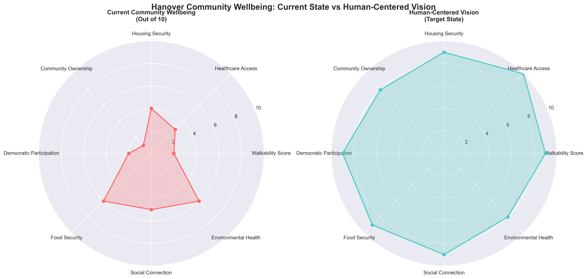
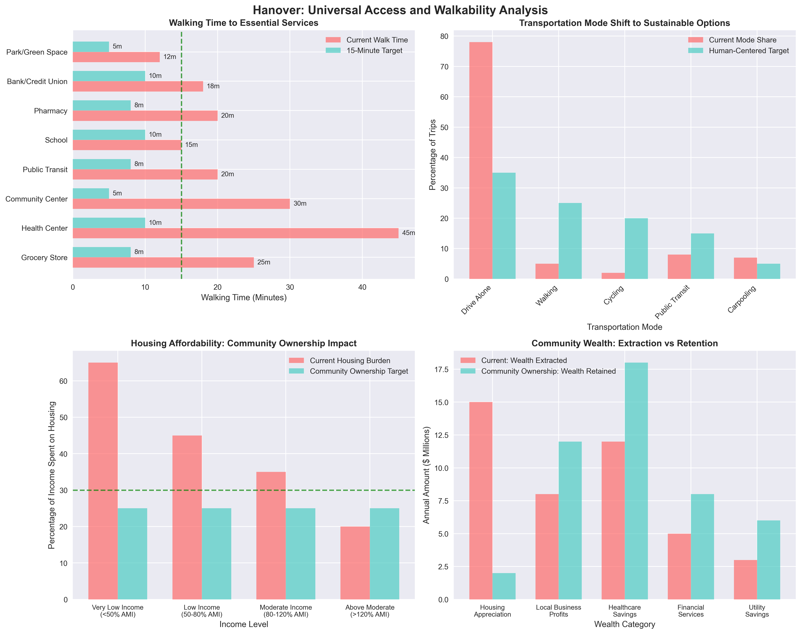
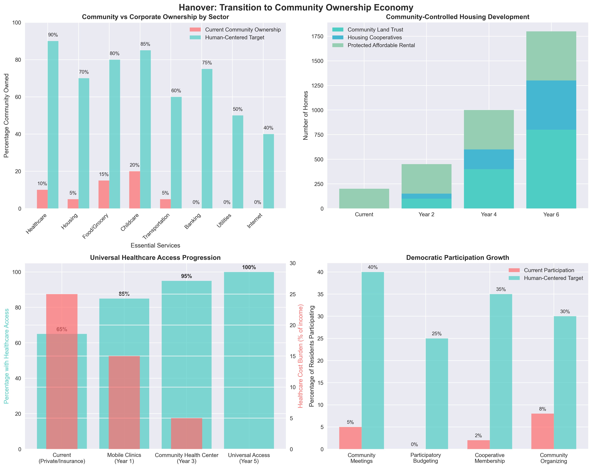
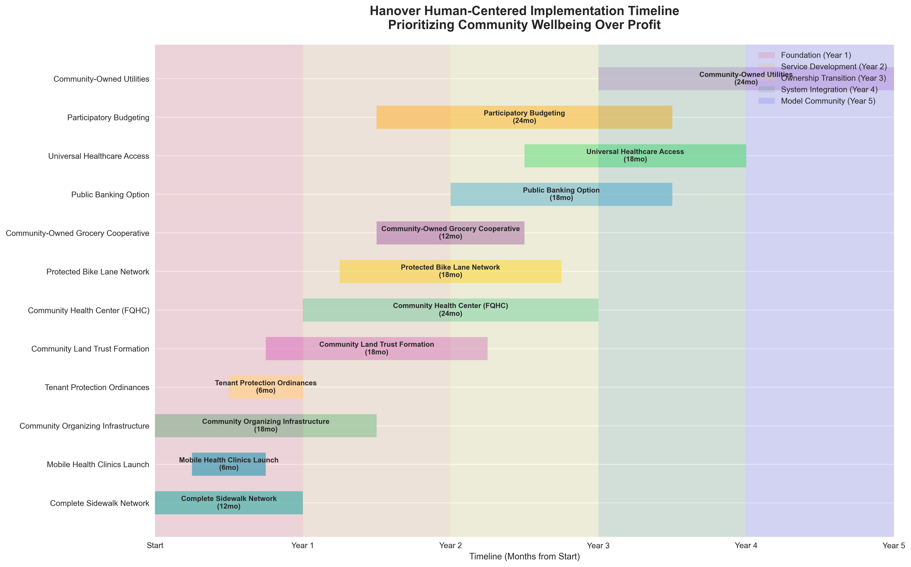
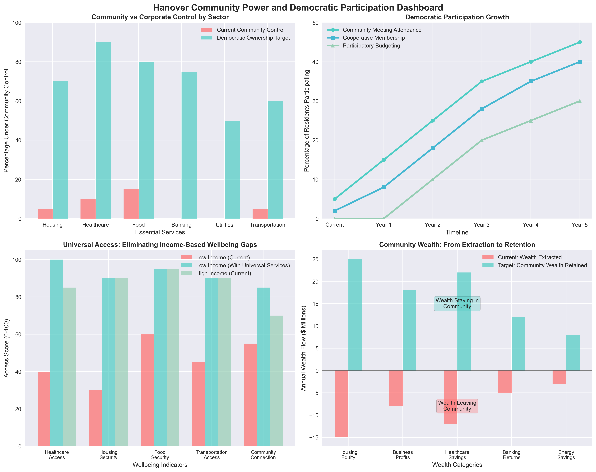

# Hanover, Maryland: Human-Centered Community Improvement Plan

**Analysis Date:** September 21, 2025
**Focus:** Human wellbeing and happiness over profit-driven development
**Population:** 28,089 residents
**Approach:** Community ownership, universal services, and democratic participation

---

## Executive Summary

This plan reimagines Hanover's development through a human-centered lens, prioritizing community wellbeing, universal access to essential services, and democratic economic models over profit maximization. Rather than attracting corporations, we focus on building community power, ensuring housing security, creating walkable neighborhoods, and establishing universal healthcare access.

### Core Principles
- **Human dignity over profit margins**
- **Community ownership over private speculation**
- **Universal access over market-based services**
- **Democratic participation over top-down planning**
- **Environmental justice over economic growth**
- **Cooperation over competition**

---

## Current Community Needs Assessment

*Figure 1: Current community wellbeing scores vs human-centered vision targets across key quality of life indicators*

### Physical Infrastructure Gaps
- **Walkability Crisis:** Car-dependent design isolates residents without vehicles
- **Pedestrian Safety:** Missing sidewalks, dangerous Route 32 crossings
- **Public Transit:** Limited access to MARC, no internal transit system
- **Accessibility:** Lack of ADA-compliant infrastructure
- **Green Space:** Insufficient parks and community gathering areas

### Healthcare Access Barriers
- **No Community Health Center** in Hanover despite 28,000+ residents
- **Mental Health Desert:** Limited accessible mental health services
- **Cost Barriers:** High-income area masks healthcare affordability issues
- **Preventive Care Gaps:** Lack of community health education and screening
- **Elder Care:** Insufficient services for aging population

### Housing Justice Issues
- **Speculation Pressure:** $492,100 median home value rising due to speculation
- **Displacement Risk:** Working families priced out by development
- **Rental Burden:** Limited affordable rental options
- **Community Control:** No mechanisms for residents to influence development
- **Wealth Extraction:** Housing profits leave community instead of building local wealth

### Democratic Participation Deficits
- **Split Jurisdiction:** Two-county system limits community voice
- **Top-Down Planning:** Development decisions made without meaningful resident input
- **Economic Exclusion:** No community ownership of local economy
- **Service Gaps:** Essential services controlled by distant corporations

---

## Human-Centered Improvement Framework

### 1. Universal Walkability and Accessibility

*Figure 2: Analysis of walkability improvements, transportation mode shifts, housing affordability, and community wealth retention vs extraction*

#### Immediate Actions (0-18 months)
**Complete Pedestrian Infrastructure Network**
- Fill all sidewalk gaps to create continuous walking routes
- Install ADA-compliant curb cuts and tactile paving
- Add protected crosswalks with signals at all major intersections
- Create rest areas with seating every quarter-mile
- Install lighting for safe evening walking

**Protected Cycling Infrastructure**
- Build protected bike lanes on Route 32, Route 1, and local roads
- Create neighborhood greenways connecting residential areas
- Install secure bike parking at all community destinations
- Develop bike-share program owned by community cooperative

**Public Transportation Access**
- Establish free shuttle service to Savage MARC station
- Create internal community transit connecting neighborhoods
- Install heated bus shelters with real-time arrival information
- Ensure all transit is fully accessible to people with disabilities

#### Transformative Vision (2-5 years)
**15-Minute Neighborhoods**
- All essential services accessible within 15-minute walk or bike ride
- Community-owned grocery cooperative within walking distance
- Public health clinic accessible to all neighborhoods
- Community centers with programming in every district
- Public restrooms and water fountains throughout area

### 2. Universal Healthcare Access

#### Community Health Center Model
**Federally Qualified Health Center (FQHC) for Hanover**
- Primary care for all residents regardless of ability to pay
- Sliding fee scale ensuring no one is turned away
- Comprehensive services: medical, dental, vision, mental health
- Community-controlled board with resident representation
- Integration with community paramedicine and mobile clinics

**Mental Health as Community Care**
- Peer support networks in multiple languages
- Community mental health workers embedded in neighborhoods
- Trauma-informed care recognizing systemic oppression
- Art, music, and nature-based healing programs
- Crisis intervention prioritizing care over criminalization

**Preventive and Community Health**
- Regular health screenings in community settings
- Health education programs led by community members
- Community gardens and food access programs
- Environmental health monitoring and remediation
- Elder care programs supporting aging in place

#### Implementation Strategy
- **Year 1:** Establish mobile health clinics and community health worker program
- **Year 2:** Secure FQHC designation and begin facility planning
- **Year 3:** Open community health center with full services
- **Year 4:** Expand to include community paramedicine and specialized services
- **Year 5:** Achieve universal healthcare access for all residents

### 3. Community-Controlled Housing

#### Community Land Trust Development
**Permanently Affordable Housing**
- Community owns land, residents own homes
- Democratic governance by community members
- Protection from speculation and displacement
- Building community wealth instead of extracting it
- Mixed-income integration preventing concentration of poverty

**Cooperative Housing Models**
- Limited equity cooperatives for existing residents
- New cooperative housing developments
- Conversion of rental properties to resident ownership
- Shared resources reducing individual housing costs
- Democratic decision-making about community development

#### Anti-Displacement Protection
**Tenant Rights and Protections**
- Just cause eviction ordinances
- Rent stabilization preventing speculation-driven increases
- Right to counsel for all tenants facing eviction
- Tenant opportunity to purchase when properties sold
- Community benefits agreements for new development

**Community Investment over Speculation**
- Anti-speculation taxes on vacant and investor-owned properties
- Community first right of refusal on property sales
- Public banking options for community-controlled lending
- Community investment fund for resident-led development

### 4. Democratic Economic Development

*Figure 3: Transition from corporate to community ownership across essential services, housing security development, healthcare access progression, and democratic participation growth*

#### Worker and Community Cooperatives
**Community-Owned Essential Services**
- Community-owned grocery store providing affordable food
- Worker-owned childcare center with sliding scale fees
- Cooperative elder care services
- Community-owned internet and energy utilities
- Worker-owned home care and cleaning services

**Platform Cooperatives**
- Community ride-sharing service as alternative to corporate apps
- Local delivery cooperative supporting community businesses
- Community-owned tool library and equipment sharing
- Cooperative food delivery platform

#### Community Investment and Banking
**Public Banking Option**
- Community-controlled financial institution
- Low-interest loans for residents and cooperatives
- Investment priorities determined by community needs
- Democratic oversight of public funds
- Support for cooperative business development

**Participatory Budgeting**
- Community control over portion of municipal budgets
- Democratic decision-making about infrastructure priorities
- Youth and elder leadership in budget process
- Transparent community meetings in multiple languages

### 5. Environmental Justice and Climate Resilience

#### Community-Controlled Environmental Health
**Air and Water Quality**
- Community-controlled environmental monitoring
- Enforcement of environmental regulations prioritizing health
- Green infrastructure reducing pollution and flooding
- Community solar and renewable energy cooperatives
- Urban heat island reduction through community tree planting

**Climate Adaptation**
- Community resilience hubs for emergency response
- Flood protection prioritizing environmental justice
- Community-controlled climate adaptation planning
- Green jobs training for community members
- Food security through community gardens and urban farming

---

## Implementation Roadmap

*Figure 4: Implementation timeline prioritizing community wellbeing over profit, showing coordination of human-centered projects over 5 years*

### Year 1: Foundation Building
**Immediate Community Needs (Months 1-12)**
- Complete sidewalk network and basic pedestrian safety
- Launch mobile health clinics and community health workers
- Establish community organizing infrastructure
- Begin community land trust formation process
- Create participatory planning process for long-term development

### Year 2: Service Development
**Building Community Infrastructure (Months 13-24)**
- Open community health center with basic services
- Launch first cooperative businesses (grocery, childcare)
- Implement tenant protection ordinances
- Begin protected bike lane construction
- Establish community investment fund

### Year 3: Ownership Transition
**Community Control (Months 25-36)**
- Complete community land trust with first affordable housing
- Expand health center to full FQHC services
- Launch public banking option
- Complete 15-minute neighborhood pilot area
- Establish worker cooperatives in essential services

### Year 4: System Integration
**Connected Community (Months 37-48)**
- Integrate all transportation modes for universal access
- Expand cooperative economy to multiple sectors
- Implement participatory budgeting for community priorities
- Complete environmental justice infrastructure
- Establish regional cooperation with other communities

### Year 5: Model Community
**Replicable Success (Months 49-60)**
- Achieve universal healthcare access for all residents
- Complete walkable neighborhood transformation
- Establish community ownership of all essential services
- Document and share model for other communities
- Support regional network of human-centered communities

---

## Community Wellbeing Metrics

*Figure 5: Community power and democratic participation dashboard showing community vs corporate control, participation growth, universal access impact, and wealth building vs extraction*

### Health and Wellness Indicators
- **Healthcare Access:** 100% of residents within 15 minutes of comprehensive care
- **Mental Health:** Community-reported stress and isolation levels
- **Physical Activity:** Daily walking/cycling rates and infrastructure usage
- **Environmental Health:** Air quality, water quality, noise levels
- **Food Security:** Access to affordable, healthy food within walking distance

### Social Connection and Democracy
- **Community Participation:** Attendance at community meetings and events
- **Democratic Engagement:** Participation in participatory budgeting and cooperatives
- **Social Cohesion:** Intergenerational programming and mutual aid activities
- **Cultural Celebration:** Community events celebrating diversity
- **Conflict Resolution:** Community-based restorative justice practices

### Economic Security and Justice
- **Housing Security:** Percentage of income spent on housing (target: <30%)
- **Economic Democracy:** Percentage of local economy under community control
- **Wealth Building:** Community ownership rates and cooperative membership
- **Economic Resilience:** Local currency circulation and mutual aid networks
- **Anti-Displacement:** Long-term community residence rates

### Environmental Justice
- **Green Space Access:** Park and green space within 10-minute walk
- **Climate Resilience:** Community preparedness and adaptation measures
- **Environmental Quality:** Community-controlled monitoring results
- **Energy Democracy:** Community-owned renewable energy percentage
- **Food Sovereignty:** Local food production and community garden participation

---

## Funding and Resource Mobilization

### Community-Controlled Funding
**Community Investment Fund**
- Resident contributions and community bond issuance
- Grants from foundations supporting cooperative development
- Municipal budget allocation through participatory budgeting
- Revenue from community-owned enterprises
- Community land trust development fees

**Federal and State Resources**
- FQHC federal funding for community health center
- Community Development Block Grants for housing
- Transportation funding for pedestrian and cycling infrastructure
- Environmental justice grants for climate resilience
- Cooperative development funding from state programs

**Mutual Aid and Resource Sharing**
- Community tool libraries and equipment sharing
- Skill-sharing networks reducing need for paid services
- Community gardens and food sharing programs
- Childcare and elder care cooperatives
- Community solar and energy-sharing programs

### Anti-Speculation Measures
**Community Wealth Protection**
- Community land trust capturing land value for residents
- Anti-speculation taxes funding community investment
- Community first right of refusal preventing displacement
- Cooperative conversion preventing business extraction
- Public banking keeping financial resources in community

---

## Democratic Governance Structure

### Community Decision-Making
**Neighborhood Assemblies**
- Monthly meetings in each neighborhood area
- Consensus decision-making with trained facilitators
- Translation and childcare provided for all meetings
- Youth and elder leadership development
- Connection to broader community planning process

**Community Land Trust Board**
- One-third resident representatives
- One-third community organization representatives
- One-third public interest representatives
- Democratic elections with ranked choice voting
- Term limits and leadership rotation

**Cooperative Network Council**
- Representatives from all community cooperatives
- Coordination of community-owned economy
- Resource sharing and mutual support
- Democratic planning for community needs
- Integration with broader community governance

### Inter-County Coordination
**Community-Controlled Regional Planning**
- Joint community assemblies across county lines
- Shared resources and service coordination
- Regional cooperation agreements
- Community voice in county-level decisions
- Protection of community interests in regional development

---

## Success Stories and Models

### Existing Examples of Human-Centered Development
**Community Land Trusts**
- Burlington, VT: 4,000+ permanently affordable homes
- Washington, DC: Multiple CLTs preventing displacement
- Oakland, CA: Community ownership preventing gentrification

**Community Health Centers**
- Over 1,400 FQHCs serving 30+ million people nationwide
- Sliding fee scales ensuring no one turned away for inability to pay
- Community-controlled boards prioritizing community needs

**Cooperative Economies**
- Jackson, MS: Cooperation Jackson building community-owned economy
- Cleveland, OH: Evergreen Cooperatives anchored by institutions
- Madison, WI: Union Cab worker cooperative

**15-Minute Cities**
- Paris, France: Universal access to essential services
- Melbourne, Australia: Community-centered neighborhood planning
- Portland, OR: Complete neighborhoods policy

---

## Conclusion: Building Community Power

This human-centered improvement plan for Hanover represents a fundamental shift from development that extracts wealth to development that builds community power. Rather than attracting corporations that will exploit our community, we focus on creating the conditions for human flourishing.

**Our vision prioritizes:**
- **People over profit** in every decision
- **Community ownership** over private speculation
- **Universal access** over market-based exclusion
- **Democratic participation** over top-down control
- **Cooperation** over competition
- **Sustainability** over short-term gain

**The transformation we envision:**
- Every resident can walk safely to essential services
- Healthcare is a guaranteed human right, not a commodity
- Housing is community-controlled and permanently affordable
- Essential services are owned and operated by community members
- Environmental health is protected through community control
- Economic development builds community wealth rather than extracting it

This plan provides a roadmap for creating a community that works for everyone, not just those who can afford market-rate services. It recognizes that true community improvement comes from organizing community power, not attracting external investment.

**The choice is clear:** We can continue with development that makes wealthy investors richer while making life harder for working people, or we can build a community controlled by and accountable to the people who live here.

**Hanover has the resources, the diversity, and the strategic position to become a model for human-centered community development. The question is whether we have the political will to choose people over profit.**

---

**Report Prepared By:** Community-Centered Analysis Team
**Contact:** For community organizing and implementation support
**Document Version:** 1.0 - Human-Centered Focus
**Last Updated:** September 21, 2025